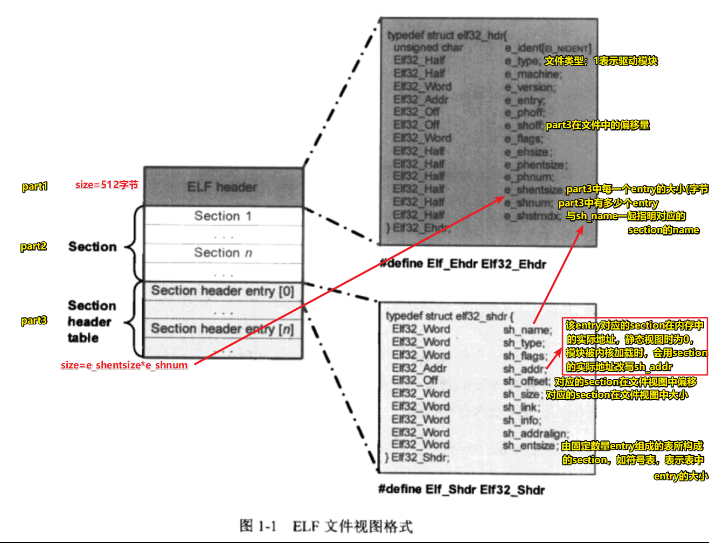
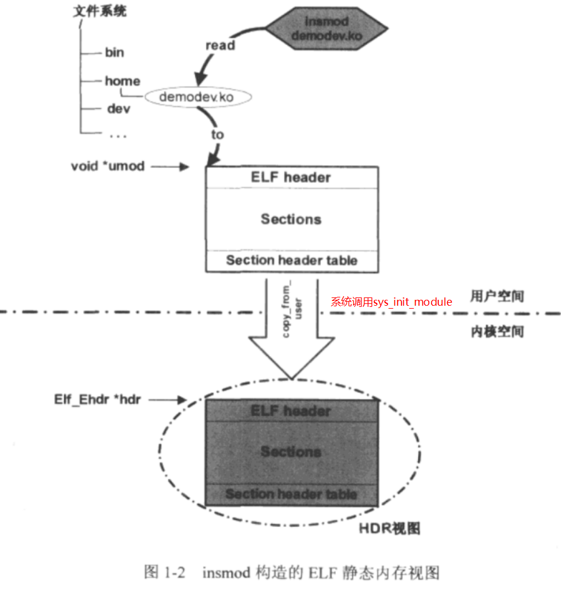
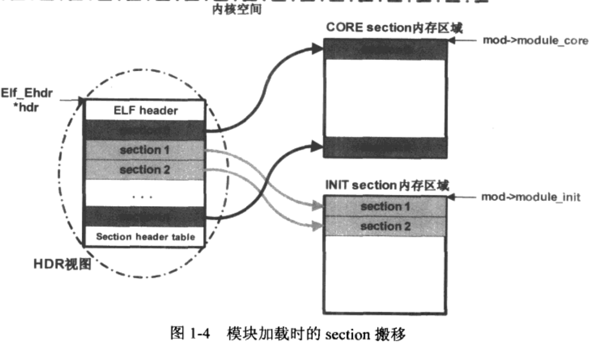

## 第一章 内核模块

### 目的

- 模块的加载过程
- 模块如何引入用内核或者其他模块中的函数与变量
- 模块本身导出的函数与变量如何被别的内核模块使用
- 模块的参数传递机制
- 模块之间的依赖关系
- 模块中的版本控制机制

#### 1.1内核模块文件格式

内核模块是一种普通的可重定位目标文件。ELF(Executable and Linkable Format)格式



#### 1.2 EXPORT_SYMBOL的内核实现

​	对于静态编译链接而成的内核映像而言，所有的符号引用都将在静态链接阶段完成。

​	作为独立编译链接的内核模块，要解决这种静态链接无法完成的符号引用问题（在模块elf文件中，这种引用称为“未解决的引用”） 

​	处理"未解决引用"问题的本质是在模块加载期间找到当前“未解决的引用”符号在内存中的实际目标地址。

​	内核和内核模块通过符号表的形式向外部世界导出符号的相关信息。方式：EXPORT_SYMBOL,经三部分达成：EXPORT_SYMBOL宏定义部分，链接脚本连接器部分和使用到处符号部分。

​	在链接脚本告诉链接器把目标文件中名为`__ksymtab` 和`__ksymtab_strings`的section放置在最终内核（或内核模块）映像文件的名为 `__ksymtab`和`__ksymtab_strings`的section中， 然后用EXPORT_SYMBOL 来导处符号，实际上是要通过 struct kernel_symbol的一个对象告诉外部世界关于这个符号的符号名称(`__ksymtab_strings`中)和地址(`__ksymtab`中)，这个地址会在模块加载过程中由模块加载器负责修改该成员以反映出符号在内存中最终的目标地址，这个过程也就是"重定位"过程.

#### 1.3 模块的加载过程

##### 1.3.2 struct module

load_module返回值时struct module。是内核用来管理系统中加载模块时使用的，一个struct module对象代表着现实中一个内核模块在linux系统中的抽象。

重要成员：

```c
struct module{
    ...
    enum module_state; /*记录模块加载过程中不同阶段的状态*/
    struct list_head list;/*用来将模块链接到系统维护的内核模块链表中*/
    char name[MODULE_NAME_LEN];/*模块名称*/
    const struct kernel_symbol *syms;/*内核模块导出的符号所在起始地址*/
    const unsigned long *crcs;/*内核模块导出符号的校验码所在起始地址*/
    struct kernel_param *kp;/*内核模块参数所在的起始地址*/
    ini (*init)(void);/*指向内核模块初始化函数的指针，在内核模块源码中由module_init宏指定*/
    struct list_head source_list;
    struct list_head target_list; /*用来再内核模块间建立依赖关系*/
    ...
};
```

##### 1.3.3 load_module

- 模块ELF静态的内存视图

  

  - 字符串表（string table）

  ​	在驱动模块所在ELF文件中，有两个字符串表section，一个用来保存各section名称的字符串，另一个用来保存符号表中每个符号名称的字符串。

  ​	section名称字符串表的基地址：char *secstrings=(char *)hdr+entry[hdr->e_shstrndx]​.sh_offset. 其中e_shstrndx是段名称字符串表在段首部表中的索引. 想获得某一section的名称，通过索引i可得地址 secstrings+entry[i].sh_name.

  ​	符号名称字符串表的基地址：char *strtab=(char *)hdr+entry[entry[i].sh_link].sh_offset. 即首先遍历Section header table中所有的entry，找一个entry[i].sh_type=SHT_SYMTAB的entry，SHT_SYMTAB表明这个entry所对应的section是一符号表。这种情况下，entry[i].sh_link是符号名称字符串表section在Section header table中的索引值。

  - HDR视图的第一次改写

    获取到section名称字符串表基地址secstrings和符号名称字符串表基地址strtab后，函数开始遍历part3的所有entry，将sh_addr改为entry[i].sh_addr= (size_t)hdr+entry[i].offset。

  - find_sec函数

    寻找某一section在Section header table中的索引值

    static unsigned int find_sec(Elf_Ehdr *hdr, Elf_Shdr *sechdrs, const char *secstrings, const char *name);

    遍历Section header table中的entry,通过secstrings找到对应的section名称和name比较,相等后返回对应索引值。

    HDR视图第一次改后，然后查找此三个section(".gun,linkonce.this_module","__versions",".modinfo")对应的索引值赋给modindex,versindex,infoindex

  - struct module类型变量 mod初始化

    模块的构造工具为我们安插了一个".gun,linkonce.this_module" section，并初始化了其中一些成员如.init(即init_module别名(initfn)(即module_init(initfn)中的initfn),和.exit。在模块加载过程中load_module函数利用这个section中的数据来初始mod变量。次section在内存中的地址即为：mod=(void *)sechdrs[modindex].sh_addr。

  - HDR视图的第二次改写

    哪些section需要移动？移动到什么位置？layout_sections负责

    有标记SHF_ALLOC的section(分两大类CORE和INIT)

    - CORE section

    遍历Section header table，section name不是".init"开始的section划为CORE section。改对应entry的sh_sh_entsize,用来记录当前section在CORE section中的偏移量。

    entry[i].sh_entsize=mod->core_size;

    > sh_entsize:
    > 有些节的内容是一张表,其中每一个表项的大小是固定的,比如符号表;对于这种表来说,该字段指明这种表中的每一个表项的大小;如果该字段的值为0,则表示该节的内容不是这种表格;

    mod->core_size+=entry[i].sh_size;//记录当前正在操作的section为止，CORE section的空间大小

    code section用 module结构中的core_text_size来记录

    - INIT section

    section name 必须以".init"开始，内核用struct module结构中的init_size来记录当前INIT section空间大小

    mod->init_size+=entry[i].sh_size;

    code section 用module的init_text_size来记录

    

    CONFIG_KALLSYMS启用后会在内核模块中保留所有符号，在ELF符号表section中，由于没有SHF_ALLOC标志，layout_sections不会移动符号表section,所以用layout_symtab将其移动到CORE section中。

    之后内核用vmalloc为CORE section和INIT section分配对应内存空间，基地址分别在mod->module_core和mod->module_init中。接着就搬移CORE和INIT section到最终位置。之后更新其中各section对应table中entry的sh_addr.

    ".gun.linkonce.this_module" section带有SHF_ALLOC标志，也移到CORE section,所以要更新

    mod=(void *)entry[modindex].sh_addr;

    为什么要移动？

    模块加载过程结束时，系统会释放掉HDR视图所在的内存区域，模块初始化工作完成后，INIT section所在内存区域也会被释放，所以最终只会留下CORE section中的内容到整个模块存活期。

    

  - 模块导出符号

